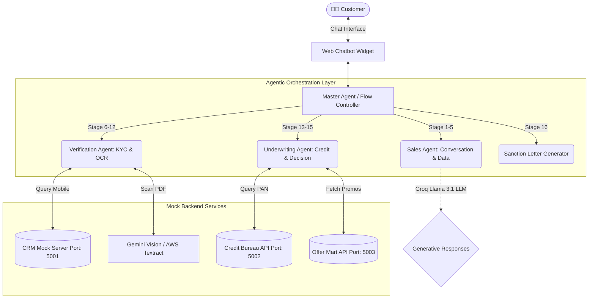
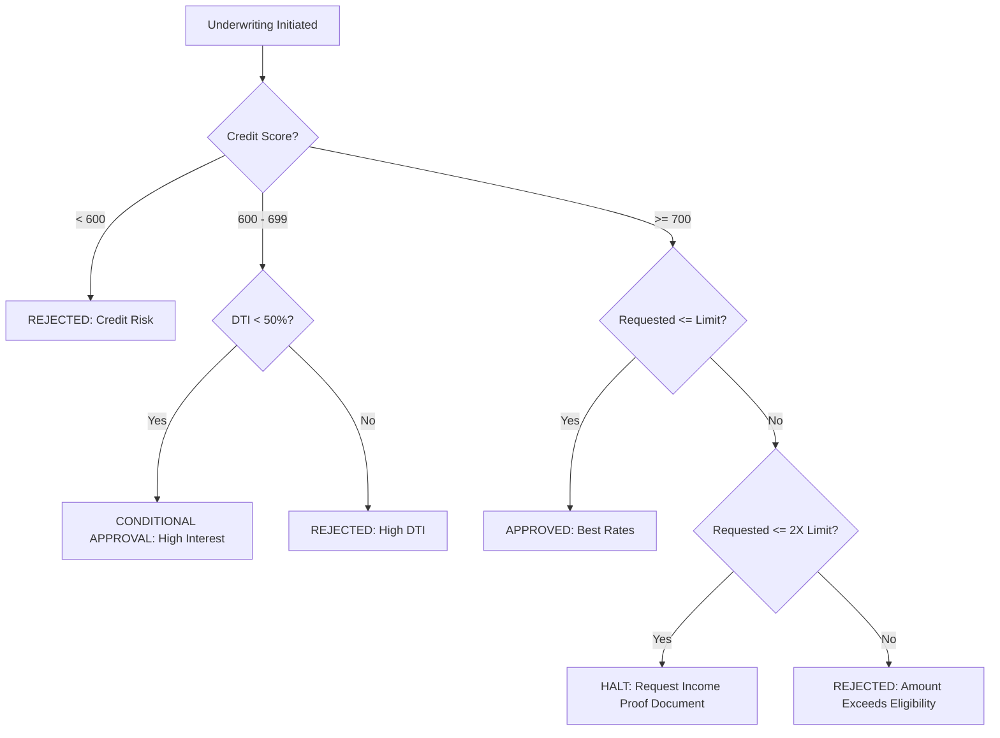

# AI-Driven Personal Loan Chatbot: Complete System Architecture & Operations Manual

This document provides an exhaustive, highly-detailed breakdown of the AI-driven NBFC loan chatbot project. It covers the technical architecture, mathematical calculations, Agentic AI orchestration, and strategic business advantages compared to legacy banking systems.

## 1. Executive Summary & Business Problem

### Current Industry Problem
A large-scale Non-Banking Financial Company (NBFC) currently faces significant drop-offs in personal loan applications. Traditional banking processes involve:
- Cumbersome web forms prompting high application abandonment.
- High manual intervention for KYC and document verification.
- Delayed underwriting decisions.
- High customer acquisition costs due to human sales executive dependency.

### The Agentic AI Solution
We built a deterministic, multi-agent AI web chatbot that acts as a **Digital Sales Assistant**. It converts prospects into active applicants through a simulated, empathetic human conversation, while rigorously adhering to compliance, KYC verification, and dynamic underwriting rules in real-time.

---

## 2. Advanced System Architecture (LangGraph & Multi-Agent Design)

The core intelligence of the orchestration layer combines **Generative AI (Groq LLM/Llama 3.1)** for conversational fluidity with a **Deterministic StateMachine (LangGraph methodology)** to ensure financial compliance. 

### 2.1 The Master Agent (Orchestrator)
The **Master Agent** (`DeterministicFlowController`) acts as the central brain. It dictates a strict **16-stage state machine** (from `GREETING` to `SANCTION`). It is responsible for routing the user's intent to the appropriate **Worker Agent** and locking the session state to prevent prompt-injection attacks.

### 2.2 Worker Agents
1. **Sales Agent:** Handles negotiations, empathy, and data collection (Purpose, Amount, City).
2. **Verification Agent:** Manages OTP generation, Identity Locking, and Document OCR (PAN, Income).
3. **Underwriting Agent:** Computes the dynamic Credit Score, fetches DTI, and enforces predefined business rules to generate an `APPROVED`, `CONDITIONAL`, or `REJECTED` decision.
4. **Sanction Generator:** Programmatically constructs a downloadable PDF sanction letter finalizing the EMI and interest rate.

### 2.3 Architecture & Agent Interaction Diagram



---

## 3. Deep Dive: Mathematical Calculations & Decision Rules

The system does not rely on the LLM to perform mathematical calculations (preventing hallucinations). All calculations use deterministic internal algorithms designed to mimic real-world banking logic.

### 3.1 Dynamic Credit Score Index (Out of 900)
To avoid relying on a preset database for the demo, our Underwriting Agent algorithm dynamically scores the user from 0 to 900 based entirely on the inputs they provide during the chatbot conversation. 

**Total: 900 points possible across 5 Factors:**

| Factor | What We Check | Max Points | How It's Scored |
| :--- | :--- | :--- | :--- |
| **DTI (Debt-to-Income)** | `Existing EMI ÷ Income` | 300 | 0% DTI → 300pts; 50%+ → 0pts |
| **Income Level** | Monthly income amount | 250 | ₹1L+ → 200pts; ₹50K → 150pts |
| **Employment Type** | Salaried vs. Self-employed | 150 | Salaried → 150pts; Self-employed → 100pts |
| **Age** | User's age | 100 | 25-55 (Prime) → 100pts |
| **Loan-to-Income Ratio** | `Requested amount ÷ Annual income` | 100 | Low ratio → 100pts; High → less |

> **Concrete Credit Score Example: "Priya Sharma"**
> *Profile: ₹1.5L/mo salary, Salaried, 30 years old, No existing EMIs, requesting ₹5L.*
> 
> ```text
> DTI:         0% debt    -> 300 / 300
> Income:      ₹1.5L/mo   -> 250 / 250
> Employment:  Salaried   -> 150 / 150
> Age:         30 years   -> 100 / 100
> Loan Ratio:  5L ÷ 18L   -> 80 / 100
> -----------------------------------
> TOTAL SCORE             -> 880 / 900 (APPROVED ✅)
> ```

### 3.2 Pre-Approved Limit Evaluation using FOIR
**FOIR (Fixed Obligations to Income Ratio)** is the standard banking metric utilized by top institutions (e.g., Tata Capital, HDFC) to restrict loan amounts safely. It represents the percentage of monthly income allowed for total EMIs.

| Credit Score | FOIR Cap | Meaning |
| :--- | :--- | :--- |
| **750+** | 60% | High Trust - Can dedicate 60% of income to EMIs |
| **700-749** | 50% | Moderate Trust - Cap at 50% |
| **600-699** | 40% | Higher Risk - Only 40% allowed |

**The Limit Algorithm:**
`Available for new EMI = (Monthly Income × FOIR) - Existing EMIs`
`Pre-Approved Limit = Available for new EMI × 36 Months`

> **Concrete Pre-Approved Limit Example:**
> - **Income:** ₹1,00,000/mo
> - **Existing EMI:** ₹10,000
> - **Score:** 780 (Grants 60% FOIR)
> 
> *Calculation:*
> `Available for new EMI = (₹1,00,000 × 0.60) - ₹10,000 = ₹50,000/mo`
> `Pre-approved limit = ₹50,000 × 36 months = ₹18,00,000` (₹18 Lakhs ✅)

### 3.3 The Underwriting Decision Tree

The Master Agent uses the calculated FOIR limit and the dynamic Credit Score to branch the conversation logic automatically.



### 3.4 Compound Amortized EMI Calculation
Once the loan amount is approved and the tenure is selected, the exact monthly payment is calculated natively by the server using the standard compounding formula.

**Formula:**
`EMI = [P x R x (1+R)^N] / [(1+R)^N-1]`
*Where:*
- `P` = Principal Loan Amount
- `R` = Monthly Interest Rate (Annual Rate / 12 / 100)
- `N` = Tenure in Months

> **Concrete EMI Calculation Example:**
> - **Principal (`P`):** ₹5,00,000
> - **Annual Interest:** 12.0% → **Monthly Rate (`R`):** `12 / 12 / 100 = 0.01`
> - **Tenure (`N`):** 36 months
> - `EMI = [500000 * 0.01 * (1+0.01)^36] / [(1+0.01)^36 - 1]`
> - `EMI = [5000 * 1.430768] / [1.430768 - 1]`
> - `EMI = 7153.84 / 0.430768 = ₹16,607.15 per month`

---

## 4. Comprehensive Technology Stack & Integrations

To ensure high performance, real-time observability, and AI resilience, the project is built upon a modern, full-stack architecture separating concerns across the UI, deterministic backend, and external Intelligence services.

### 4.1 Core Technologies Implemented

#### Frontend (The Digital Sales Interface & Dashboard)
- **Vite + React (TypeScript):** Powering the ultra-responsive customer-facing chat widget and the administrative dashboard.
- **Tailwind CSS:** For rapid, sleek, mimicking modern fin-tech applications.
- **WebSocket (Socket.io):** Establishes the real-time, bidirectional pipeline projecting live customer chats, stage transitions, and fraud alerts instantly to the Admin Dashboard without refreshing.

#### Backend (The State & Orchestration Engine)
- **FastAPI (Python 3.9+):** The high-speed asynchronous backend framework executing the Master Agent API (`/api/v3/chat`) and OCR endpoints (`/api/upload`).
- **LangGraph Concepts:** Orchestrating the complex, non-linear logic of conversational AI into strictly controlled state machines (directed graphs).
- **Uvicorn:** The lightning-fast ASGI web server bridging the Python logic to the web.

#### Artificial Intelligence & Large Language Models
- **Groq API (Llama 3.1 8b):** The primary brain for conversational empathy. Chosen specifically for its unparalleled inference speed (Tokens/sec), ensuring the chatbot reacts instantly like a human sales executive.
- **Local/Self-Hosted LLM Fallbacks:** Architecture built to degrade gracefully to open-source models (via Ollama) if cloud APIs fail.
- **Google Gemini 2.0 Flash Vision:** A multimodal endpoint utilized exclusively for scanning KYC documents natively (salary slips) and extracting JSON key-value pairs (Name, PAN, Net Income).
- **AWS Textract:** A secondary enterprise-grade OCR backup if Gemini goes down.

#### Synthetic Environment APIs (Port 5001, 5002, 5003)
Built natively in the project using separate Python processes to mock real banking microservices:
- **CRM Database Mock**
- **Credit Bureau (CIBIL Simulator)**
- **Offer Mart Engine**

---

### 4.2 Technology Integration Diagram

This diagram visualizes how the different technologies and stacks plug into each other across the network layer.


### 4.3 Intelligent Redundancy (Backups)
Financial applications require strict uptime. Our stack implements intelligent degradation:
1. **LLM Rotation:** The `generate_ai_response` engine has a list of 5 redundant backup API Keys. If Groq hits a `429 Rate Limit`, it instantly swivels to the next key without dropping the user's message.
2. **Deterministic Safetynets:** If the internet entirely disconnects the AI APIs, the Master Agent falls back to strictly hardcoded string responses. The flow *will* continue mechanically.
3. **Mock OCR Simulator:** If Gemini Vision fails to read the PDF, our smart regex fallback algorithms extract the user's data mathematically to prevent a 500 Server Error crash during demonstrations.

---

## 5. Comparative Analysis: Legacy NBFCs vs. Our Agentic Solution

| Feature | Current Real NBFC Implementation | Our Agentic AI Solution |
| :--- | :--- | :--- |
| **Customer Journey** | Fills out 5-page static web forms. High drop-off rate. | Conversational, guided WhatsApp-style interface. Empathetic negotiation. |
| **Data Collection** | Linear, inflexible inputs. Typos cause hard validation crashes. | NLP-driven. Parses typos ("salried", "5 lakhs") seamlessly into strict data types. |
| **Document Scanning** | Upload requires a 24-48 hour manual backend review by operations agents. | Instant Sub-second OCR via Gemini Vision. Performs real-time validation against declared numbers. |
| **Underwriting** | Batch processing jobs overnight or reliance on archaic rule engines causing delays. | Live algorithmic computation. Generates instant decision limits and personalized compounding EMIs within the chat. |
| **Admin Oversight** | Black box system until the lead lands in Salesforce days later. | Live WebSocket Admin Dashboard. Supervisors can watch the agent negotiate with users character-by-character. |

---

## 6. Real-World Business Advantages & Future Prospects

### Problems Solved
1. **Cart Abandonment:** The conversational interface combined with dynamic pre-approved limits reduces form fatigue.
2. **Operational Overhead:** Replaces Tier-1 support and review teams with autonomous, instant KYC verification via OCR.
3. **Data Integrity:** The "Identity Lock" capability hard-freezes session variables securely upon successful SMS OTP, preventing injection attacks.

### Future Scalability & Prospects
1. **Omnichannel Expansion:** The LangGraph architecture natively decouples the Web Interface from the Logic. This backend can cleanly plug into WhatsApp Business API or Instagram DM bots directly.
2. **Voice AI Integration:** The current text-based Llama output can be routed into a TTS (Text-to-Speech) engine like ElevenLabs, evolving the Chatbot into an AI Phone Caller.
3. **Alternative Credit Scoring:** Integration with Account Aggregators (AA) to analyze real-time bank statements dynamically (parsing spending habits) instead of a simple flat OCR read, allowing lending to "thin-file" or "new-to-credit" customers.
