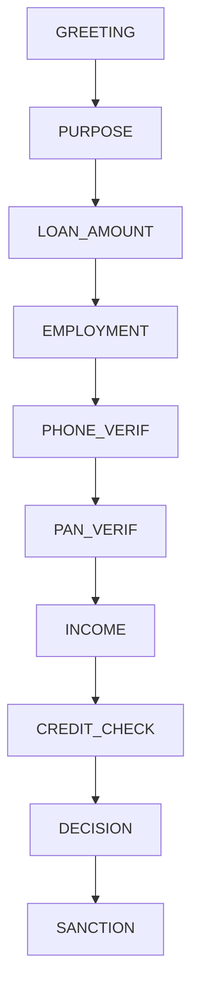

# Technical Intelligence Architecture & Implementation Guide

## 1. Executive Summary
This document provides a comprehensive technical breakdown of the **Hybrid Intelligence Architecture** used in the Agentic Lending Platform. It maps high-level business requirements (Compliance, Speed, Experience) directly to the codebase implementation.

**Core Philosophy:**
> "AI for Conversation, Deterministic Logic for Decisions."

We explicitly separate **Probabilistic AI** (LLMs for chat) from **Deterministic Logic** (Python for finance) to ensure zero hallucinations in loan underwriting.

---

## 2. Intelligence Stack Overview

| Intelligence Layer | Technology / Library | File Path | Responsibility |
| :--- | :--- | :--- | :--- |
| **1. NLU & Intent** | Regex + `sentence-transformers` | `backend/intelligence/intent_detector.py` | Understand what the user wants (<10ms). |
| **2. Conversational AI** | Gemini 1.5 Flash + Groq | `backend/intelligence/gemini_client.py` | Handle hesitation, persuasion, and financial concepts. |
| **3. Financial Engine** | Python (NumPy/Math) | `backend/core/decision_engine.py` | Calculate EMI/FOIR and make binding decisions. |
| **4. Workflow Engine** | Finite State Machine | `backend/orchestration/state_machine.py` | Enforce valid process steps (KYC -> Income -> Offer). |
| **5. Risk Analytics** | React + WebSockets | `src/pages/AdminDashboard.tsx` | Real-time monitoring for officers. |

---

## 3. Detailed Implementation Breakdown

### 🟢 Layer 1: NLP & NLU (Intent Understanding)
**Goal:** Instantly classify user agility.
**Implementation:** `backend/intelligence/intent_detector.py`

The system uses a **Two-Tier Architecture** for speed and reliability.

#### Tier 1: The "Fast Path" (Regex & Keywords)
*   **Why:** Ultra-low latency (<1ms), zero cost, 100% predictable.
*   **How:** We define rigorous regex patterns for high-confidence intents.
*   **Code Evidence:**
    ```python
    # backend/intelligence/intent_detector.py

    KEYWORD_RULES = [
        # Hesitation Detection
        (IntentType.HESITATION, 0.90, [
            r"\b(not sure|unsure|confused|thinking|maybe)\b",
            r"\b(give me time|i'?ll decide later)\b",
        ]),
        # EMI Affordability Checking
        (IntentType.EMI_AFFORDABILITY, 0.90, [
            r"\b(emi|installment).*(high|expensive|costly)\b",
            r"\b(can'?t afford|out of budget)\b",
        ]),
    ]
    ```

#### Tier 2: The "Deep Path" (Semantic Similarity)
*   **Why:** Captures nuanced phrasing that regex misses.
*   **How:** Uses `sentence-transformers/all-MiniLM-L6-v2` to generate embeddings and compare Cosine Similarity against a curated `EXEMPLAR_BANK`.
*   **Code Evidence:**
    ```python
    # Lazy loading ensures fast startup
    _model = SentenceTransformer("all-MiniLM-L6-v2")

    # Math
    scores = util.cos_sim(user_embedding, exemplar_embeddings)
    if max_score > 0.55:
        return Intent(..., method="semantic")
    ```

---

### 🤖 Layer 2: Conversational AI (Gemini Flash)
**Goal:** Provide human-like assistance for **non-transactional** queries.
**Implementation:** `backend/intelligence/gemini_client.py`

This layer is **intentionally restricted**. It cannot touch the database or approve loans.

#### Safety Guardrails (The "Anti-Hallucination" Suite)
1.  **System Prompt Restrictions**: The system prompt explicitly forbids generating numbers.
    ```python
    # gemini_client.py
    SALES_ADVISOR_PROMPT = """
    STRICT RULES:
    - never promise approval
    - never generate EMI, rates, loan limits, or credit scores
    """
    ```

2.  **Output Sanitization (Regex Firewall)**:
    Even if the LLM hallucinates a number, this regex layer strips it out before the user sees it.
    ```python
    def sanitize(text: str) -> str:
        # Removes ₹1,00,000, 10.5%, 750 (credit score)
        text = re.sub(r'₹\s?\d[\d,]*', '[calculated by system]', text)
        text = re.sub(r'\d+\.?\d*\s*(%|percent)', '[rate determined by system]', text)
        return text
    ```

#### Latency & Reliability Architecture
*   **Primary**: Gemini 1.5 Flash (Google) - Fast, cheap, high context.
*   **Fallback**: Groq (Llama 3.1) - Extremely fast inference if Gemini times out.
*   **Tertiary**: Hardcoded Strings - If both AIs fail, the system degrades gracefully to pre-written text.

---

### 🧮 Layer 3: Deterministic Financial Engine
**Goal:** Compute loan eligibility with **100% auditability**.
**Implementation:** `backend/core/`

This replaces AI "judgment" with hard mathematical rules.

#### The Decision Engine (`decision_engine.py`)
This is the single source of truth. It aggregates multiple signals:

1.  **Credit Score Check**:
    ```python
    if credit_score < 650:
        return REJECT  # Hard Floor
    elif credit_score >= 750:
        return APPROVE # Auto-Approval
    ```

2.  **FOIR Calculation (Affordability)**:
    We strictly follow the formula: `(Existing EMI + Proposed EMI) / Income <= 50%`.
    ```python
    # underwriting_rules.py
    foir = (existing_obligations + proposed_emi) / monthly_income
    if foir > 0.50:
        reject = True
    ```

3.  **EMI Calculation**:
    Standard reducing balance formula to ensure penny-perfect matching with core banking systems.
    ```python
    # emi_calculator.py
    emi = P * r * (1 + r)^n / ((1 + r)^n - 1)
    ```

---

### 🔄 Layer 4: Workflow Intelligence (State Machine)
**Goal:** Prevent process violation (e.g., getting a loan without KYC).
**Implementation:** `backend/orchestration/state_machine.py`

We use a **Finite State Machine (FSM)** to enforce the journey.

#### Transition Diagram


#### Input Validators
Every state transition is gated by a validator function. You cannot move forward unless the validator returns `True`.
*   `_validate_pan`: Enforces `[A-Z]{5}[0-9]{4}[A-Z]` regex.
*   `_validate_income`: Ensures income > 0.

---

### � Layer 5: Risk & Document Analytics
**Goal:** Visualize the "Black Box" for operations teams.
**Implementation:** `src/pages/AdminDashboard.tsx`

#### Real-Time Data Pipeline
1.  **Backend Event**: State machine updates `session_data`.
2.  **WebSocket Stream**: `state_machine.py` emits event via `manager.broadcast()`.
3.  **Frontend Hook**: `AdminDashboard` listens to `ws://.../stream`.
4.  **React Render**: UI updates instantly without page refresh.

#### Document Intelligence (`document_agent.py`)
*   **Simulated Verification**: The system identifies document types from filenames (e.g., `salary_slip.pdf`) and simulates an OCR/Verification pass.
*   **Checklist Logic**:
    *   *Salaried*? Need: Salary Slip + Bank Statement.
    *   *Business*? Need: ITR + GST Certificate.

---

## 4. Why This Architecture Wins

### 1. Regulatory Compliance
*   **Problem**: Regulators (RBI/SEBI) forbid "Black Box" AI lending decisions.
*   **Solution**: Our decision engine is **100% deterministic code**. We can print the exact line of code that rejected a user. AI is only used for chat.

### 2. Hallucination Proof
*   **Problem**: LLMs love making up low interest rates (e.g., "Sure, take 2% interest!").
*   **Solution**: The `sanitize()` layer physically removes numbers from AI output. The AI *cannot* quote a rate even if it wants to.

### 3. Production Readiness
*   **Problem**: AI models are slow and heavy.
*   **Solution**:
    *   **Lazy Loading**: Models load only when first needed.
    *   **Hybrid Routing**: 90% of queries use Regex (0ms), only 10% use AI (2s).
    *   **Fallbacks**: If Google is down, Groq takes over. If Groq is down, templates take over.
